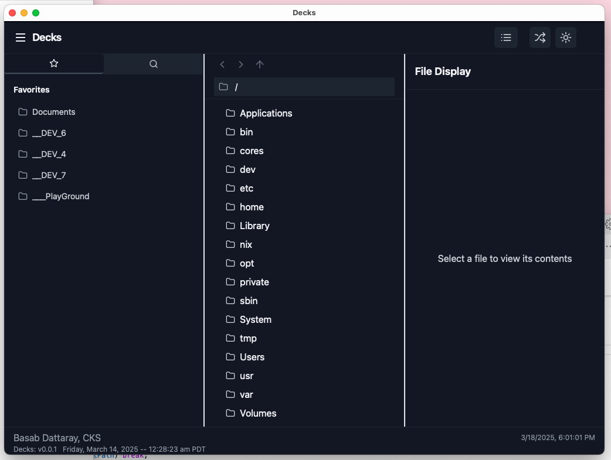
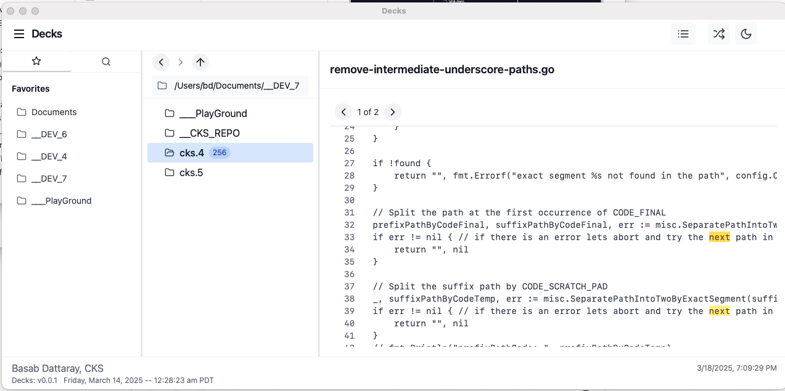

# 📁 Tauri File Navigator - alias Decks (Dev Explorer for Code Kick Start)

A lightweight, cross-platform file manager built with **Tauri**, **Rust**, **React**, **TypeScript**, and **Tailwind CSS**. Inspired by macOS Finder and Windows File Explorer, this project provides a clean, modern, and efficient interface for navigating and searching files.

## ✨ Features

- 🖥️ **Cross-platform**: Runs on Windows (Untested), macOS (Tested), and Linux(Untested).
- ⚡ **Lightweight**: Powered by Tauri, making it smaller and faster than Electron-based alternatives.
- 🔍 **File Navigation & Search**: Easily browse and search files in your system.
- 🎨 **Modern UI**: Styled with Tailwind CSS for a sleek and responsive experience.
- 🚀 **Fast & Efficient**: Rust-powered backend ensures performance and security.

## 🎯 Purpose

This project serves two main goals:

1. **Starter Template for Productivity Tools**: Provides a foundation for building desktop applications with Tauri.
2. **Showcase Tauri's Capabilities**: Demonstrates how to integrate Tauri with React, TypeScript, and Tailwind for desktop applications.

## 🛠️ Tech Stack

- **Tauri** (Rust-based lightweight desktop framework)
- **Rust** (Backend processing)
- **React** (Frontend UI)
- **TypeScript** (Type-safe development)
- **Tailwind CSS** (Modern styling)

## 📚 Resources

- [Tauri Documentation](https://tauri.app/v1/guides/) – Learn more about Tauri and its features.
- [React](https://react.dev/) – Official documentation for building UI with React.
- [TypeScript](https://www.typescriptlang.org/) – Type-safe JavaScript for scalable applications.
- [Tailwind CSS](https://tailwindcss.com/) – Utility-first CSS framework for rapid UI development.

## 🚀 Getting Started

### Prerequisites

Ensure you have the following installed:

- [Node.js](https://nodejs.org/) (for frontend development)
- [Rust](https://www.rust-lang.org/) (for Tauri backend)
- [Tauri CLI](https://tauri.app/) (for building and running the app)

### Installation

1. **Clone the repository**
   ```sh
   git clone https://github.com/dattaray-basab/TauriFileNavigator.git
   ```
2. **Run in Dev mode **
   ```sh
   yarn install && yarn tauri dev

            - OR -

   npm install && npx tauri dev

   ```
3. **Build and Install in Prod mode **
   ```sh
   yarn install && yarn tauri build

            - OR -

   npm install && npx tauri build

   ```


## 🐞 Debugging Tauri Apps

To debug your Tauri app effectively:

1. **Enable Debug Logs**: Run with verbose mode
   ```sh
   npm run tauri dev -- --log-level debug
   ```
2. **Debug Frontend in Chromium**:
   - Open the app and press `Ctrl+Shift+K` (Windows/Linux) or `Cmd+Option+K` (Mac) to access the developer console.

4. **VS Code Debugging**:
   - Configure `.vscode/launch.json` for Rust debugging.

## 📷 Screenshots




```

## 🤝 Contributing

Contributions are welcome! Feel free to submit issues and pull requests to improve this project.

## 📜 License

This project is licensed under the **MIT License**.

---

